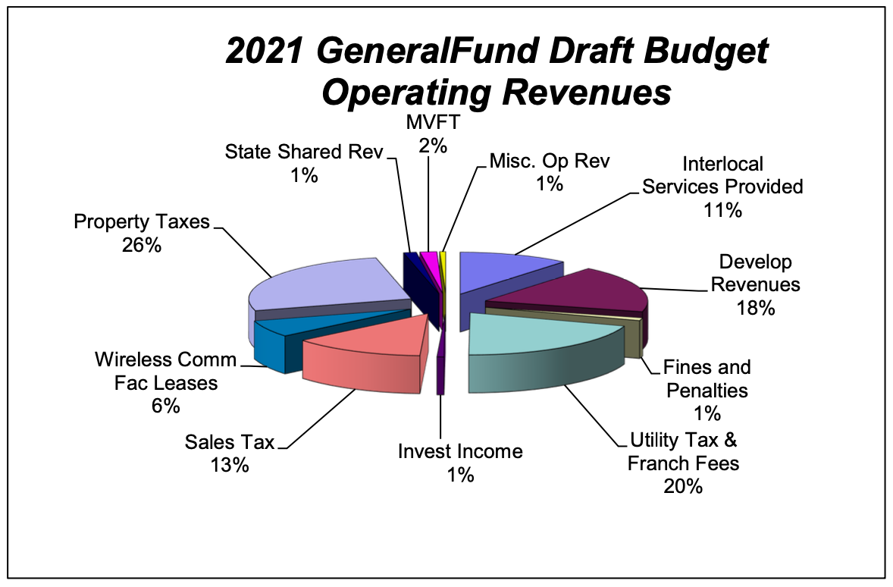

## Clyde Hill Budget, Part TK: Revenue

Because Clyde Hill is almost entirely residential, the tax base is uneven and different from a typical city. Here's a table from a draft budget, followed by some thoughts, and of course a pie chart at the end:

| Revenue source | % |
| --- | ---: |
| Property Taxes | 26% |
| Utility Tax & Franchise Fees	| 20% |
| Develop Revenues	| 18% |
| Sales Tax	| 13% |
| Interlocal Services Provided	| 11% |
| Wireless Comm Fac Leases	| 6% |
| Motor Vehicle Fuel Tax (MVFT)	| 2% |
| State Shared Rev	| 1% |
| Misc Op Rev	| 1% |
| Invest Income	| 1% | 
| Fines and Penalties	| 1% | 

(This table is from Clyde Hill's [_Council Budget-Related Study Session_ (Sep 2020)](https://clydehill.civicweb.net/document/13225?splitscreen=true&attachmenturl=%2Fdocument%2F13205), "3.2.2 - 2020 & 2021 High-Level Comparisons")

“The City’s ability to increase or grow this revenue from any or all of these sources is limited by statute, practicality and fairness.” It's also worth noting that until last year, Clyde Hill had “not taken the allowed 1% growth in property taxes for 10 years and not taken the allowed new construction component since 2016.”

Property taxes, while stable, provide ~26% of the General Fund's revenue, down from 31% ten years ago. “One of the problematic conditions facing local governments is that property taxes, while stable, rise more slowly than expenditures.” 

### Clyde Hill’s revenue depends heavily on sales tax on construction activity in the city.

Typically for Clyde Hill, this revenue is from residential redevelopment. Specifically, the revenue is Clyde Hill's share in the sales tax on materials being delivered to construction sites. Clyde Hill also collects permit fees. Clyde Hill recently finished several years of _exceptional_ revenue from the redevelopment of the two public schools (Chinook Middle School, Clyde Hill Elementary) here. Note that development revenue is cyclical because development activities are, and that revenue from these sources is not restricted in its use. There is another revenue source here: “If a property changes hands, the City receives a third type of revenue, Real Estate Excise Tax (REET) that is restricted in its use, primarily toward capital needs.”)

Another source of sales tax revenue is products and services delivered to residents (assuming they record their address as Clyde Hill and not Bellevue). Note that “The City has almost no commercial retail base to augment the sales tax received.”

"Interlocal Services Provided" refers to "police and other services provided to other communities.”

Quotes from 2.1.1, “INITIAL 2021 BUDGET STUDY SESSION PACKET” (September 16, 2020)

